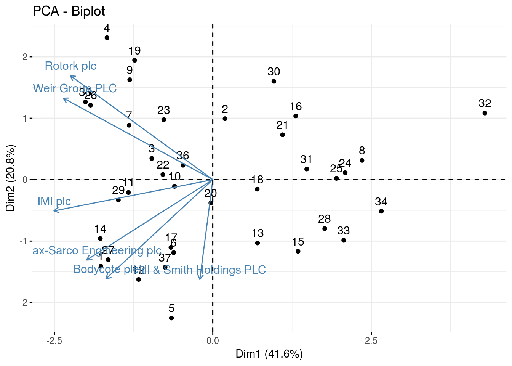
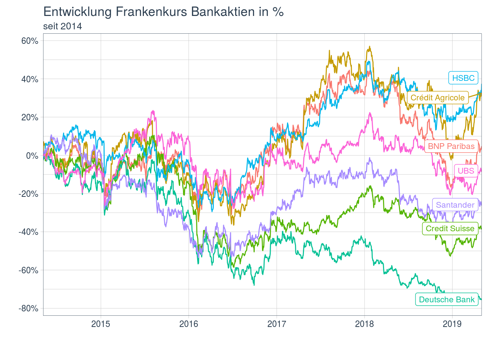
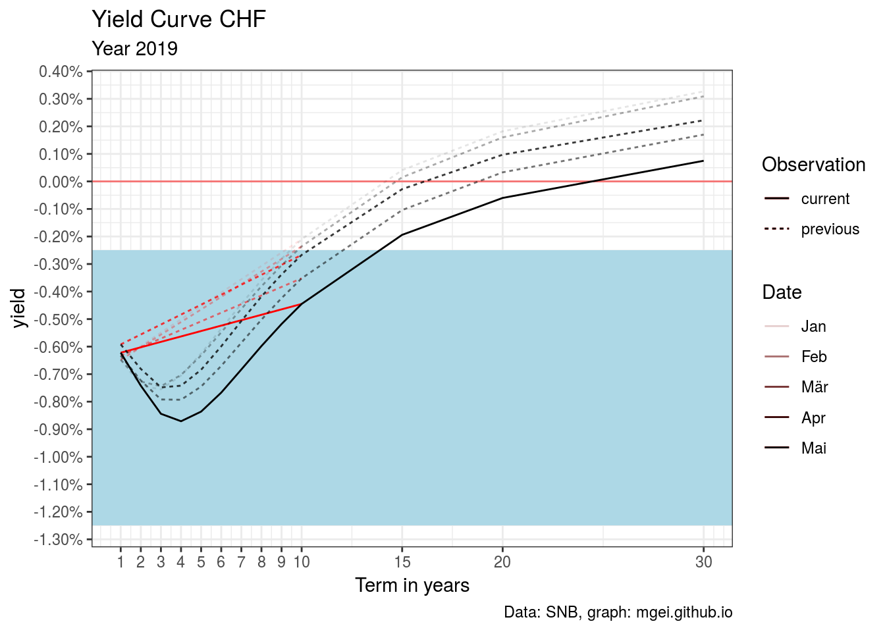
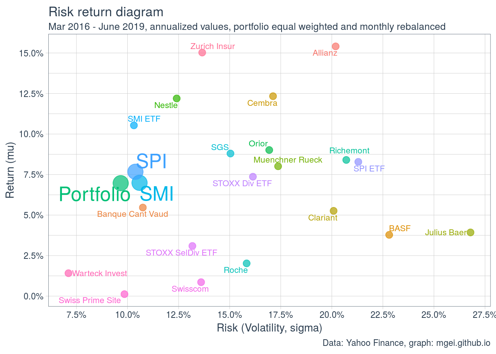
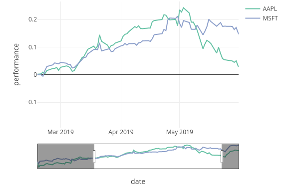
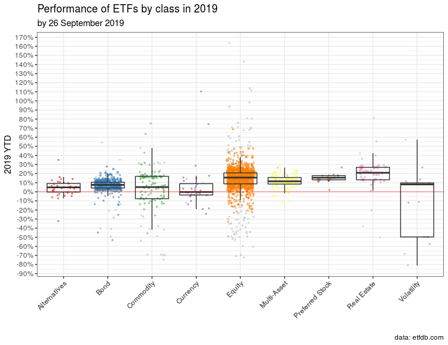

# a collection of R functions to download stock index data

...works only in predefined specific setting. Not robust at all!

As of March 3, 2019 automatic download works for:

* Quandl
* Yahoo Finance
* S&P Dow Jones Indices (https://us.spindices.com)
* BNP (relies on `library(RSelenium)` and Firefox Browser, not very stable)
* STOXX
* Ossiam
* SIX (various specific parameters implemented in 4 functions)
* ICE
* Vienna
* FTSE


Automatic download no longer works for:

* MSCI Indices (has to be manually downloaded from https://www.msci.com/end-of-day-data-country)
* HFR (has to be downloaded manually from https://www.hedgefundresearch.com/download-hfrx-index-performance-data registration required)


System: Ubuntu 16.04, R 3.5.2, Firefox Quantum 65.0

## Notes


* The running `main.R` will read a spreadsheet file `Basiswerte.xlsx`, which predefines the tickers of interest to me. However, the download functions can also be run independently of it.

* For **Quandl** a API key is required. You can get it in your personal Quandl.com settings. See the *setup* part of `main.R` to read it. The key could be stored in a file `quandlkey.private`.
* Error `Error in curl::curl_fetch_disk(url, x$path, handle = handle) : SSL certificate problem: unable to get local issuer certificate` could be solved with https://stackoverflow.com/a/54660072
* Error `Error in wdman::selenium(port = port, verbose = verbose, version = version,  : Selenium server signals port = 4566 is already in use.`: no solution found yet, https://stackoverflow.com/a/43993442 didn't help

# PCA use case

See in `PCA` directory. Published on RPubs here: http://rpubs.com/mgei/pca-usecase



# European bank stocks

See in `european-banks` directory. Available on RPubs: http://rpubs.com/mgei/european-banks



# Market June 2019 - VIX and the inverted yield curve

https://mgei.github.io/post/market-june19/



# Portfolio performance evaluation

https://mgei.github.io/post/performance-eval/



# R various

## Using plotly's rangeslider for relative performance graphs



Stackoverflow: https://stackoverflow.com/questions/56551892/using-ggplotly-rangeslider-for-interactive-relative-performance-stock-returns

# ETFs

## etfdb.com download data

[etfdb.com screener](https://etfdb.com/screener/) is a great tool for finding ETFs. As of today, there are 2290 ETFs listed. I like to sort by total assets, which is default.

Unfortunately, the site uses pagination and things to prevent people from scraping the whole list. I had no chance to get it done from R directly. But I found [janlukasschroeder/etfdb-api](https://github.com/janlukasschroeder/etfdb-api) which provides functions to download the whole list from the screener.

To get it to run:

1. Install things if you had never used Node.js or React (like myself)

Follow this if you're on Ubuntu: https://www.techomoro.com/how-to-install-and-setup-a-react-app-on-ubuntu-18-04-1/

```
curl -sL https://deb.nodesource.com/setup_12.x | sudo -E bash -
sudo apt-get install -y nodejs
```

```
sudo npm install npm@latest -g
```

```
npm install -g create-react-app
```

(might need sudo)

2. Make a new file `data.js` (is this even the file ending one uses for node.js?)

```
const etfdb = require('etfdb-api');

etfdb
  .listEtfs((perPage = 2290), (page = 1), (sort = 'assets'), (order = 'desc'))
  .then(result => {
    console.log('Total ETFs:', result.meta.total_records);
    console.log('etf.symbol.text, etf.name.text, etf.mobile_title, etf.assets, etf.average_volume, etf.asset_class, etf.ytd');
    result.data.forEach(etf => console.log(etf.symbol.text, ';', etf.name.text, ';', etf.mobile_title, ';', etf.assets, ';', etf.average_volume, ';', etf.asset_class, ';', etf.ytd));
  });
```

3. Run with `node data.js` or actually save the output to a csv with

```
node data.js > output.csv2
```

4. Import to R

## Performance


